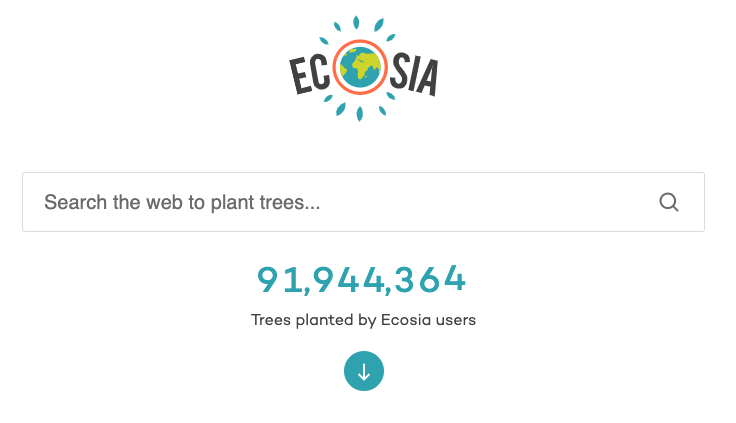
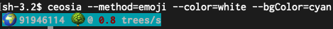
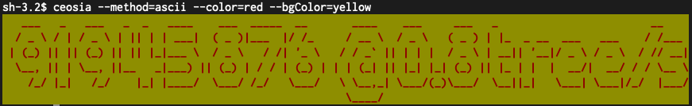

# CEOSIA 

A simple CLI app to give you the current count of the trees planted by the wonderful people over at **https://www.ecosia.org/**

##  WHY make this?

Well, when you do not have the __luxury__ of a browser, i.e: you work mainly in the terminal or want to get a hopefull `ascii` banner in your builds. 

## Recommended installation
This package you can install globally: 

> sudo npm install -g .

after that you can leverage the power of these four very useful packages:  

 - [chalk](https://www.npmjs.com/package/chalk)
 - [figlet](https://www.npmjs.com/package/figlet)
 - [minimist](https://www.npmjs.com/package/minimist) 
 - [node-fetch](https://www.npmjs.com/package/node-fetch)

 to get a current `count`of plantet trees and the `rate` at which these get planted.

## Usage

At your disposal are these four parametters:

> `--method=ascii|emoji|terminal`
> 
> `--color=red|green|blue...` see [chalk](https://www.npmjs.com/package/chalk) documentation
> 
> `--bgColor=white|cyan|gray...` see [chalk](https://www.npmjs.com/package/chalk) documentation
>
> `--live=true `

Some examples: 

> `$ ceosia`
>
> `91945516 trees planted @ 0.8 trees/s.`

> ceosia --method=emoji --color=red --bgColor=cyan
> 

> ceosia --method=ascii --color=red --bgColor=yellow
>

---
# Enjoy ! 